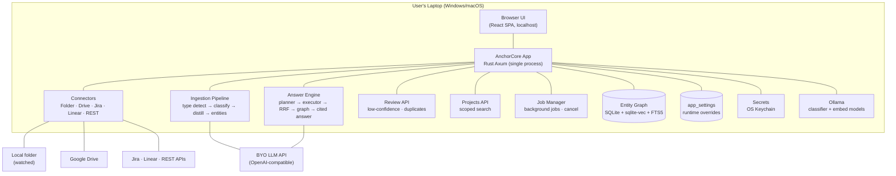
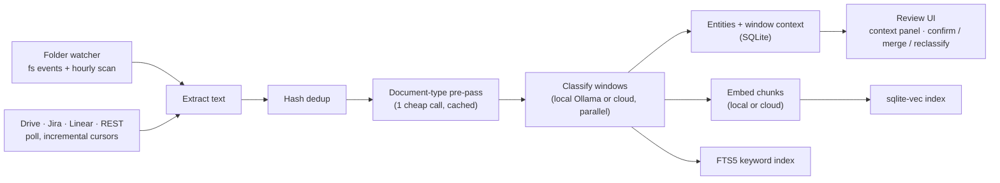
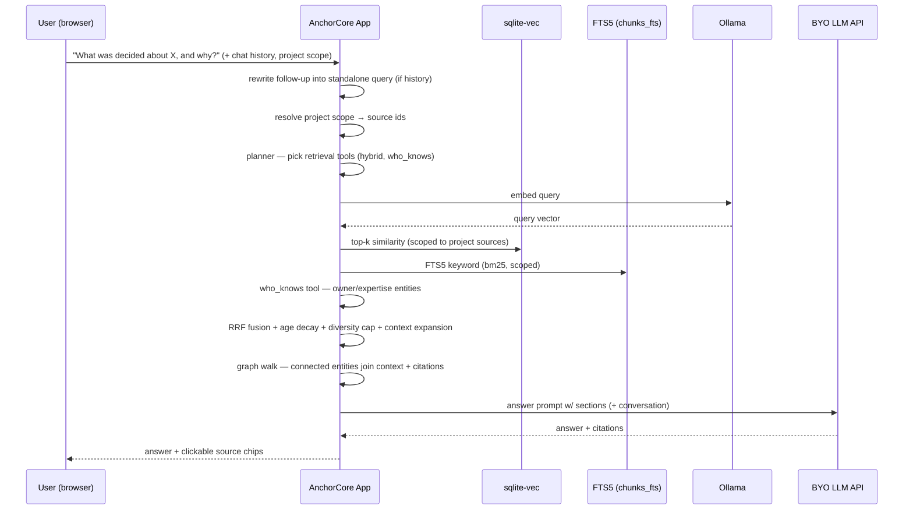
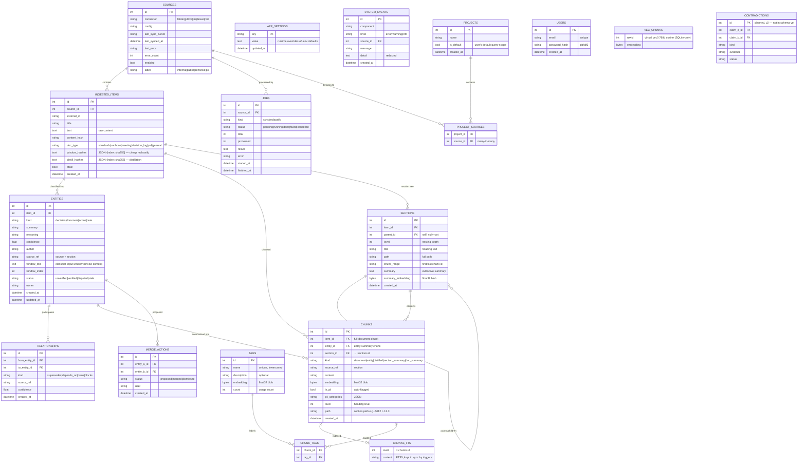

# AnchorCore — Architecture Overview

> Stack: **Rust (Axum) · React (Vite) · SQLite locally (sqlite-vec vec0 +
> FTS5) / Postgres for hosted (`hosting/`, Python, `pgvector/pg16`) · Ollama
> or BYO cloud LLM APIs** — env-driven. **Rust is the shipped backend;
> Python `backend/` is deprecated except `hosting/`** (decision R10.7).

---

## 1. Runtime Model: Local-First, Hosted Env-Driven

One local process = the entire product. No Docker, no sidecar services, no
setup. **Local:** Rust binary `anchorcore` (`frontend/dist` embedded,
SQLite `vec0` + FTS5). **Hosted:** `hosting/` Docker + Postgres stays a
Python FastAPI image, env-driven via `ANCHOR_DATABASE_URL` — the SQLite
FTS5/vec0 triggers skip on Postgres (falls back to scan). See
`hosting/README.md` + `docs/v2v3-scope.md`.

## 2. System Diagram



## 3. Data Flow — Ingestion



**Deletion policy:** deleting a source cascade-deletes everything under it
(items, entities, chunks, jobs) via FK cascade. Re-syncing a changed document
replaces its entities/chunks. Retrieval always excludes `stale` entities —
and `disputed` ones unless opted back in.

**Chunking & cleaning:**

| Layer | Function | Config | Purpose |
|---|---|---|---|
| Cleaning | `clean_text` + repeated-line stripping | — | Strip control chars, page numbers, repeated headers/footers and normalize whitespace *before* chunking, so boundaries, embeddings and FTS tokens are clean |
| Entity summary | `chunk_text` (`chunking.py` / `chunking.rs`) | `ANCHOR_CHUNK_SIZE=800`, `ANCHOR_CHUNK_OVERLAP=100` (chars, UTF-8 safe) | Fixed 800/100 slices of each entity summary → `chunks kind=entity` |
| Full-document | `chunk_document` | `ANCHOR_CHUNK_MAX_CHARS=1600` | Section-aware: hard split at headings (`§434`, `4.2.1`, `Article 12`, ALL-CAPS), paragraphs packed per section up to 1600 chars, fixed-slice fallback only for oversized paragraphs |
| Classifier windows | `classify_windows` | `ANCHOR_CLASSIFY_WINDOW_CHARS=16000`, 50% overlap | Overlapping windows for the classifier — not stored as chunks, but governs hash dedup and cost |

The pipeline runs clean → strip → chunk → store (`Chunk(kind=document)`,
old doc chunks deleted on re-sync). Known gap: Rust still only trims instead
of full `clean_text` (parity follow-up).

**Distillation:** chat-like windows (meetings, decision logs, general notes)
are normalized into searchable Q&A units stored as `kind='distilled'` chunks.
An IDF gate (`embed_min_signal=0.15`) skips low-signal filler from vector
embedding — it stays keyword-findable in FTS5. Distillation is hash-skipped
per window.

**Scale — hierarchical TOC (shipped 1.0.12):** documents keep their structure
now. Headings become a saved `sections` tree (parent/level/path/summary),
passages point at their section, and a `tags` taxonomy is built as documents
arrive (similar topics merged at 0.82 similarity). Retrieval goes
coarse-to-fine — tag prune, summary search over ~5k section summaries, then
leaf search inside the winning sections — instead of ranking all ~150k
chunks flat. Full detail: `docs/guides/hierarchical-toc.md`.

## 4. Data Flow — Q&A



### 4a. Access pattern — flat vs hierarchical

*Flat:* `ask` resolves project source ids → the planner picks tools (`hybrid`
always, `who_knows` on ownership cues) → the executor runs them with one
shared embedding call (`hybrid` = vec0 vector + FTS5 keyword) → fusion (RRF
`score=Σ w/(60+rank)`, age decay, per-item diversity cap, context expansion,
near-duplicate dedupe) → 1–2 hop graph walk → PII/sensitive gate for
unapproved providers → cited generation. Every retrieval path takes an
optional source-id scope; every hit carries chunk, entity, item, source and
score.

*Hierarchical (shipped 1.0.12):* the same pipeline with a TOC pre-stage
(`toc_search` before flat hybrid). Persisted sections + tags let retrieval
prune *before* vector search: tag/SQL filter, summary-node vector search over
~5k summaries, then leaf vec0 restricted to the top sections. Falls back to
flat hybrid when the TOC pass is empty. Context expansion reads same-section
siblings. Endpoints: `GET /sections`, `GET /tags`.

## 4b. Retrieval Design (informed by Cerebras' knowledge base)

Cerebras published how their internal KB serves 15k queries/day (2026-07).
Their design validated our hybrid approach and added concrete techniques we
adopted:

1. **Multi-scorer fusion, no single trusted scorer** — they run full-text,
   embeddings, and IDF-scored retrievers in parallel and fuse the ranked
   lists. We fuse FTS5 (bm25) + cosine via **reciprocal rank fusion (RRF)**:
   `score = Σ weight / (60 + rank)`. Consensus across scorers beats a single
   strong vote; no score normalization needed.
2. **Per-file diversity cap** — a document that matches broadly must not
   monopolize the top-k. After fusion, cap results per file (default 3);
   relaxed for single-file corpora so a big document's sections can surface.
3. **Age decay** — when relevance is otherwise equal, the newer hit wins. A
   recency multiplier is applied in fusion.
4. **Context expansion** — once winners are picked, pull the neighboring
   sections (heading, preconditions, caveats) that chunking split apart, so
   the LLM sees a complete section instead of a lonely paragraph.
5. **Near-duplicate chunk dedupe** — TOC entries duplicating body sections
   keep only the best-scoring copy.

Follow-up questions reuse retrieval with a **query-rewrite pass**: history is
sent with the question, a cheap LLM call rewrites it standalone, and the
conversation is included in generation.

**Planner → Executor → Synthesis:** a lightweight planner picks the
retrieval tools for each query (`hybrid` vector+FTS always; `who_knows` for
ownership/expertise questions). The executor runs them (one shared embedding
call), each tool returns a ranked hit list in a normalized evidence shape, and
synthesis RRF-fuses them into the final context. An LLM planner can replace the
heuristic rules later without changing the executor contract.

**Graph-based retrieval:** after RRF picks the winning entities, the
pipeline walks `relationships` 1–2 hops (`supersedes` > `depends_on` > `owns` >
`blocks` > `related`, hop decay, fan-out cap) and pulls connected entities'
summaries/chunks into the answer context as `[related]` sections + citations.
This answers "what supersedes this?" / "what depends on this decision?" that
lexical+vector fusion alone misses, because the connected knowledge doesn't
need to co-occur in the question's words. Pure SQL — no model calls.

Remaining backlog: a fuller *who_knows* ranking and per-user ACLs for hosted.
Scoped search via *projects* and PII gating both shipped.

## 5. Data Model — Uniform Entity Graph

Everything is an entity. Contradictions stay external to the baseline object.



## 6. Container Table

| Container | Responsibility | Tech |
|---|---|---|
| Web UI | Connect sources, project scoping, review queue, PII review, Q&A chat, model settings | React SPA (Vite, TS, 7 tabs) |
| API | All endpoints, orchestration, config | **Rust Axum (shipped)** — FastAPI `backend/` deprecated except `hosting` |
| Entity Store | Entities, provenance, window context, sync state | SQLite local (Rust `rusqlite`) / Postgres hosted (Python legacy) |
| Vector Store | Chunk embeddings + similarity search | sqlite-vec vec0, same file (Rust static); pgvector image for hosted (Python-scan fallback on Postgres) |
| Keyword Store | FTS5 bm25 for hybrid retrieval | SQLite FTS5 (trigger-synced; skipped on Postgres) |
| Classifier | Doc-type detection + entity extraction | Ollama or cloud OpenAI-compatible + rule fallback (Rust `classifier.rs`) |
| Embedder | Chunk embeddings | Ollama or cloud OpenAI-compatible (Rust `embedder.rs`) |
| Answer Engine | Planner → Executor → RRF fusion → graph walk → cited answer | BYO cloud model or Ollama (Rust `answer.rs`/`retrieval.rs`) |
| Retrieval | Vector cosine + FTS5 bm25, who_knows owner/author ranking, `relationships` graph walk | sqlite-vec + FTS5 + SQL (Rust) |
| Job Manager | Background sync/reclassify + cancel | `jobs` table, `MAX_CONCURRENT=2` (Rust `jobs.rs`) |
| Settings Service | Runtime-mutable model config | `app_settings` table + SecretStore (Rust `settings.rs`) |
| Secret Store | Credentials (Jira token, model keys) | OS Keychain via `keyring` + encrypted-file fallback (Rust `secrets.rs`) |

## 7. Security

- Credentials: **OS Keychain** (`keyring`), encrypted-file fallback; never in DB/config/logs.
- Local server binds 127.0.0.1 (hosted binds `0.0.0.0` behind a CORS allowlist).
- Secret values masked in logs, error responses, and API payloads (`***set***`).
- Tests never touch the real keychain (`ANCHOR_SECRETS_NO_KEYRING`).
- **Data labels:** `sources.label` (`public|internal|sensitive|pii`, default
  `internal`); `chunks.is_pii` auto-flagged. Sensitive/PII content skips
  cloud classify/embed/answer, falls back to local rules, and records a
  `system_event`. Share/MCP surface (`GET /qa/public`, `public_only`) only
  sees public sources. Per-user ACL deferred to hosted.
- Every allow/block decision is audited in `system_events`; hosted auth
  issues HS256 JWT when `ANCHOR_AUTH_SECRET` is set, otherwise disabled
  (local stays single-user).

## 8. Key Interfaces (Swap Points)

| Interface | v1 (shipped) | v2+ swap |
|---|---|---|
| `VectorStore` | sqlite-vec | Qdrant / pgvector (hosted) |
| `ModelClient` | Ollama + BYO OpenAI-compatible | Any provider |
| `SecretStore` | Keychain | Cloud secret manager |
| `Connector` | Folder, Drive, Jira, Linear, REST | Slack, Notion, Confluence |
| `AgentAdapter` | MCP sidecar (stdio, read-only) — see [mcp.md](./mcp.md) | MCP HTTP transport / registry / write-back |
| `SettingsService` | DB-backed overrides + keychain secrets | Cloud config service |
| `DB` | SQLite local · Postgres hosted (Python) | Postgres for Rust if hosted is ported |

## 9. Evolution Path

```
v1 (shipped, 1.0.12): local-first app — folder/Drive/Jira/Linear/REST connectors,
    document-aware classification + review queue, cited Q&A (hybrid RRF + vec0 +
    planner/executor + graph walk + distillation + projects + PII gate),
    hierarchical sections, MCP sidecar, Team self-hosted (Docker + offline license),
    Windows/macOS apps
  -> next: website + launch, Drive OAuth, Slack connector, hosted pilot
           (per-user ACL, contradictions, workspace export/delete)
  -> v3: agentic levels (draft, prepare-action-with-approval), enterprise compliance
```

---

*Companion docs: [product-plan.md](./product-plan.md), [packaging.md](./packaging.md), [releasing.md](./releasing.md), [mcp.md](./mcp.md), [design-system.md](./design-system.md)*
