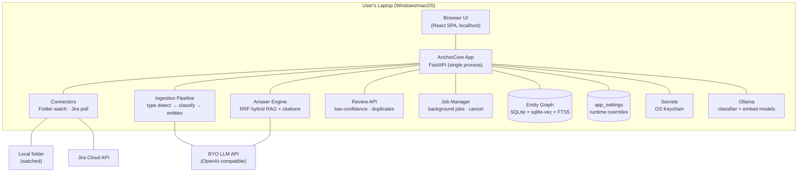
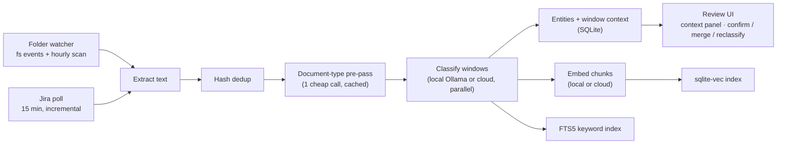
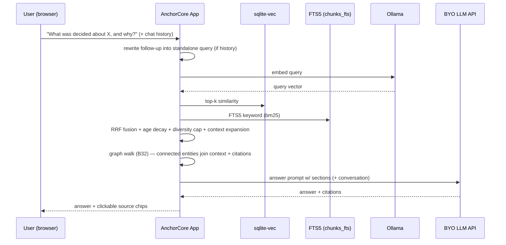
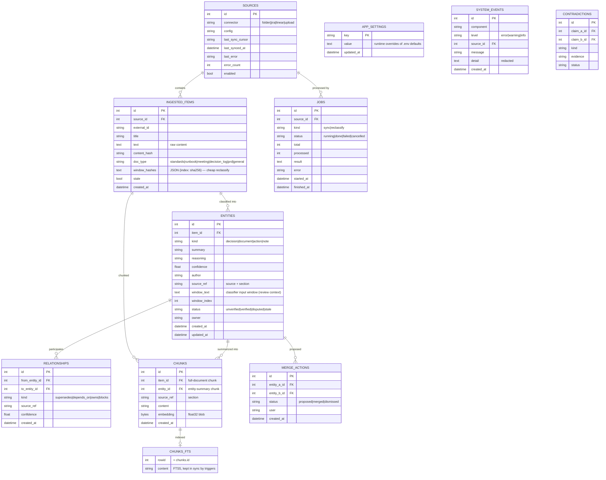

# AnchorCore — Architecture Overview (v1.0)

> Locked through structured product/architecture drilldown (13 decisions).
> Stack: **FastAPI · React (Vite) · SQLite + sqlite-vec · Ollama · BYO cloud LLM APIs**

---

## 1. Runtime Model: Local-First (Plex-Style)

One local process = the entire product. No Docker, no sidecar services, no setup.

## 2. System Diagram



## 3. Data Flow — Ingestion



**Deletion policy:** sources removed → marked `stale`; knowledge is never auto-deleted.

## 4. Data Flow — Q&A



## 4b. Retrieval Design (informed by Cerebras' knowledge base)

Cerebras published how their internal KB serves 15k queries/day (2026-07).
Their design validated our hybrid approach and added four concrete techniques
we adopted (B12.1):

1. **Multi-scorer fusion, no single trusted scorer** — they run full-text,
   embeddings, and IDF-scored retrievers in parallel and fuse the ranked
   lists. We fuse FTS5 (bm25) + cosine via **reciprocal rank fusion (RRF)**:
   `score = Σ weight / (60 + rank)`. Consensus across scorers beats a single
   strong vote; no score normalization needed.
2. **Per-file diversity cap** — a document that matches broadly must not
   monopolize the top-k. After fusion, cap results per file (default 3);
   relaxed for single-file corpora so a big document's sections can surface.
3. **Age decay** — "Slack answers expire"; when relevance is otherwise equal,
   the newer hit wins. A recency multiplier is applied in fusion.
4. **Context expansion** — once winners are picked, pull the neighboring
   sections (heading, preconditions, caveats) that chunking split apart, so
   the LLM sees a complete section instead of a lonely paragraph.
5. **Near-duplicate chunk dedupe** — TOC entries duplicating body sections
   keep only the best-scoring copy.

Follow-up questions reuse retrieval with a **query-rewrite pass**: history is
sent with the question, a cheap LLM call rewrites it standalone, and the
conversation is included in generation.

**Graph-based retrieval (B32):** after RRF picks the winning entities, the
pipeline walks `relationships` 1–2 hops (`supersedes` > `depends_on` > `owns` >
`blocks` > `related`, hop decay, fan-out cap) and pulls connected entities'
summaries/chunks into the answer context as `[related]` sections + citations.
This answers "what supersedes this?" / "what depends on this decision?" that
lexical+vector fusion alone misses, because the connected knowledge doesn't
need to co-occur in the question's words. Pure SQL — no model calls.

Further learnings parked in the backlog: scoped search via *projects* (bundles
of sources with a per-user default — "search everything everywhere" stops
being useful at scale), *who_knows* expertise queries, planner→executor→
synthesis query architecture, and distillation of raw content into
question/summary/resolution fields before embedding.

## 5. Data Model — Uniform Entity Graph

Everything is an entity. Contradictions stay external to the baseline object.



## 6. Container Table

| Container | Responsibility | Tech |
|---|---|---|
| Web UI | Connect sources, review queue, duplicate proposals, Q&A chat, model settings | React SPA (Vite, TS) |
| API | All endpoints, orchestration, config | FastAPI |
| Entity Store | Entities, provenance, window context, sync state | SQLite + SQLAlchemy |
| Vector Store | Chunk embeddings + similarity search | sqlite-vec (same SQLite file) |
| Keyword Store | FTS5 bm25 for hybrid retrieval | SQLite FTS5 (`chunks_fts`, trigger-synced) |
| Classifier | Doc-type detection + entity extraction | Ollama or cloud OpenAI-compatible + rule fallback |
| Embedder | Chunk embeddings | Ollama or cloud OpenAI-compatible |
| Answer Engine | RRF hybrid RAG + citations + follow-up rewrite | BYO cloud model or Ollama |
| Job Manager | Background sync/reclassify + cancel | asyncio tasks + `jobs` table |
| Settings Service | Runtime-mutable model config | `app_settings` table + SecretStore |
| Secret Store | Credentials (Jira token, model keys) | OS Keychain via `keyring` + encrypted-file fallback |

## 7. Security

- Credentials: **OS Keychain** (`keyring`), encrypted-file fallback; never in DB/config/logs.
- Local-only server binds 127.0.0.1.
- Secret values masked in logs, error responses, and API payloads (`***set***`).
- `SecretStore` interface maps to cloud secret managers in hosted v2.
- Tests never touch the real keychain (`ANCHOR_SECRETS_NO_KEYRING`).
- **Data labels (B30, planned)**: sources carry a label (`public|internal|sensitive|pii`);
  each model provider declares a trust tier (`local` vs user-confirmed `cloud`);
  the pipeline gates routing by label×tier (PII → local-only, logged), and
  sharing/answers/MCP exclude non-`public` content outside authorized sessions.
  Every allow/block decision is audited in `system_events`.

## 8. Key Interfaces (Swap Points)

| Interface | v1 | v2+ swap |
|---|---|---|
| `VectorStore` | sqlite-vec | Qdrant / pgvector (hosted) |
| `ModelClient` | Ollama + BYO OpenAI-compatible | Any provider |
| `SecretStore` | Keychain | Cloud secret manager |
| `Connector` | Folder, Jira | Linear, Slack, Notion, Google Drive (B28) |
| `AgentAdapter` | MCP server (stdio + HTTP) — see [mcp.md](./mcp.md) | MCP registry / deeper tool set |
| `SettingsService` | DB-backed overrides + keychain secrets | Cloud config service |
| `DB` | SQLite | PostgreSQL (hosted migration) |

## 9. Evolution Path

```
v1: local-first, folder + Jira, document-aware classification + review + cited Q&A
  -> v1.5: Linear/Drive connectors, Windows exe + macOS app, MCP access
  -> v2: team sharing, hosted option, Slack, contradictions, bundled models
  -> v3: agentic levels (draft, prepare-action-with-approval), enterprise compliance
```

---

*Companion docs: [product-plan.md](./product-plan.md), [packaging.md](./packaging.md), [releasing.md](./releasing.md), [mcp.md](./mcp.md)*
