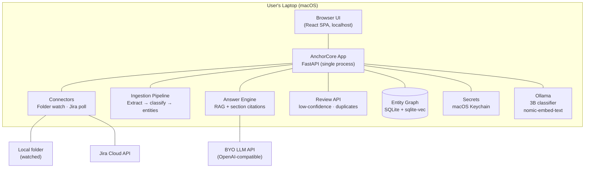
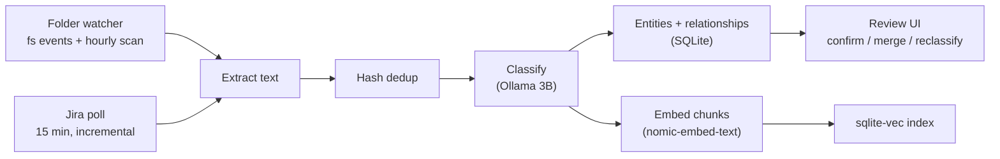
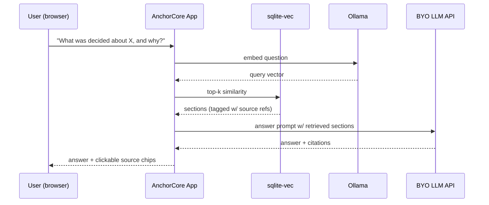
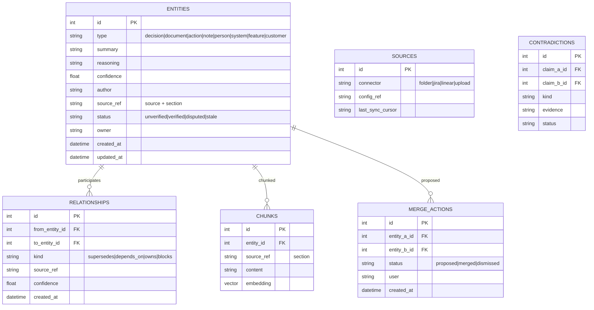

# AnchorCore — Architecture Overview (v1.0)

> Locked through structured product/architecture drilldown (13 decisions).
> Stack: **FastAPI · React (Vite) · SQLite + sqlite-vec · Ollama · BYO cloud LLM APIs**

---

## 1. Runtime Model: Local-First (Plex-Style)

One local process = the entire product. No Docker, no sidecar services, no setup.

## 2. System Diagram



## 3. Data Flow — Ingestion



**Deletion policy:** sources removed → marked `stale`; knowledge is never auto-deleted.

## 4. Data Flow — Q&A



## 5. Data Model — Uniform Entity Graph

Everything is an entity. Contradictions stay external to the baseline object.



## 6. Container Table

| Container | Responsibility | Tech |
|---|---|---|
| Web UI | Connect sources, review queue, duplicate proposals, Q&A chat | React SPA (Vite, TS) |
| API | All endpoints, orchestration, config | FastAPI |
| Entity Store | Entities, relationships, provenance, sync state | SQLite + SQLAlchemy |
| Vector Store | Chunk embeddings + similarity search | sqlite-vec (same SQLite file) |
| Classifier | Entity kind extraction | Ollama 3B + rule fallback |
| Embedder | Chunk embeddings | Ollama `nomic-embed-text` |
| Answer Engine | RAG composition + citations | BYO cloud model (OpenAI-compatible) |
| Secret Store | Credentials (Jira token, model keys) | macOS Keychain via `keyring` |

## 7. Security

- Credentials: **macOS Keychain** (`keyring`), encrypted-file fallback; never in DB/config/logs.
- Local-only server binds 127.0.0.1.
- Secret values masked in logs and error responses.
- `SecretStore` interface maps to cloud secret managers in hosted v2.

## 8. Key Interfaces (Swap Points)

| Interface | v1 | v2+ swap |
|---|---|---|
| `VectorStore` | sqlite-vec | Qdrant / pgvector (hosted) |
| `ModelClient` | Ollama + BYO OpenAI-compatible | Any provider |
| `SecretStore` | Keychain | Cloud secret manager |
| `Connector` | Folder, Jira | Linear, Slack, Notion, Drive |
| `AgentAdapter` | MCP server (stdio + HTTP) — see [mcp.md](./mcp.md) | MCP registry / deeper tool set |
| `DB` | SQLite | PostgreSQL (hosted migration) |

## 9. Evolution Path

```
v1: local-first, folder + Jira, classification + review + cited Q&A
  -> v1.5: Linear connector, packaging (.dmg)
  -> v2: team sharing, hosted option, Slack, contradictions, bundled models
  -> v3: agentic levels (draft, prepare-action-with-approval), enterprise compliance
```

---

*Companion docs: [product-plan.md](./product-plan.md), [packaging.md](./packaging.md)*
